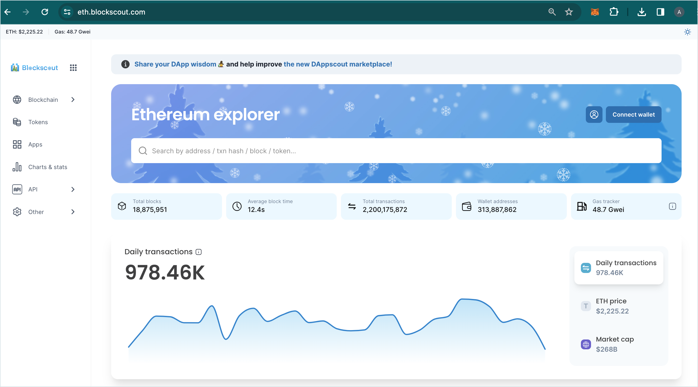

# UCHAIN.INFO Blockchain Explorer


🔵🎉 See the newly redesigned UCHAIN.INFO! Update your instance to the newest frontend now. [Get started here](for-developers/deployment/frontend-migration/)!

* [https://uchain.info/](https://uchain.info/)
  


UCHAIN.INFO provides a comprehensive, easy-to-use interface for users to view, confirm, inspect and interact on UCHAIN.

<figure><figcaption>
Ethereum mainnet explorer (winter style)
</figcaption></figure>

Information on the latest release and version history is available in the [Github repo](https://github.com/udotcash).
